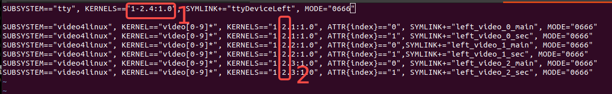
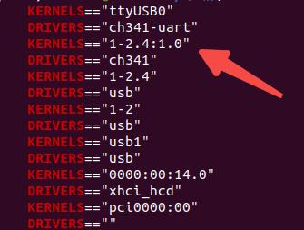
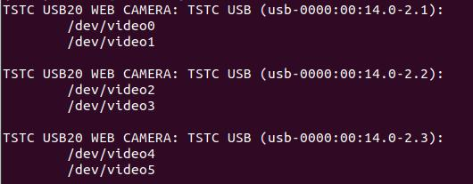
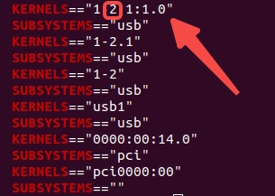

# genrobot_controller_sdk_python
## Environment Setup
```
Configure the environment according to requirements.txt
USB interface must be 3.0
```

## USB Interface Configuration

### Single Gripper USB Port Configuration
The final configuration form is as shown in the figure. After configuration, this USB port can recognize any Gen Controller, and no reconfiguration is needed afterwards. The template file is stored in:
```
config/99-usb-serial.rules
```
  

What the user needs to modify:  
  

Modification method for **Parameter 1**:
Execute:

```
cd /dev && ls | grep ttyUSB
udevadm info -a -n /dev/ttyUSB* | grep -E "KERNELS|DRIVERS"
```

Configure the second KERNELS value from the output to position 1:  


Modification method for **Parameter 2**:
Execute:
```
v4l2-ctl --list-devices
```
Output  


Then for the first camera on that USB, execute:
```
udevadm info -a -n /dev/video* | grep -E "KERNELS|SUBSYSTEMS"
```
Configure the first KERNELS value from the output to position 2  
  
Then copy the template file to the following location:
```
sudo cp config/99-usb-serial.rules /etc/udev/rules.d/
```
Then load the configuration:
```
sudo udevadm control --reload-rules
sudo udevadm trigger
```

### Dual Gripper USB Port Configuration
The final configuration form is as shown in the figure.  


What to modify:  


First plug in the left gripper and configure it using the single gripper method; then unplug the left gripper, plug in the right gripper, and configure again using the single gripper method; finally load the configuration.

### Multi-Gripper USB Port Configuration
Add the configuration to `99-usb-serial.rules` in the same way.

## SDK Execution
Run the `start_gripper.py` demo file.

### Single Gripper Demo

```
cd gen_controller_sdk_python

python3 start_gripper.py left   # Gripper fixed open at 5 cm (current config)

python3 start_gripper.py left --distance 0.08  # Gripper fixed open at 8 cm; distance range is [0.0, 0.103], i.e. max 10 cm

python3 start_gripper.py left --sine-wave  # Gripper opens and closes continuously for 10 s

```

After startup, three image windows will appear:
```
/camera_0   # Center camera
/camera_1   # Left camera
/camera_2   # Right camera

```
Printed data includes:
```
Tactile data
Gripper distance data
```

### Dual Gripper Demo
```
cd gen_controller_sdk_python
Start:
python3 start_gripper.py left
In another terminal:
python3 start_gripper.py right
```

After startup, six image windows will appear.

## Program Usage

### Reading Sensor Data
Use the following callback functions to obtain data:
```
capture_frames_callback  // Camera frame capture callback
tactile_callback         // Tactile data callback
encoder_callback         // Gripper opening/closing (encoder) data callback
```

### Sending Gripper Open/Close Control Commands
Use the following command:
```
if self.system.databus:
    self.system.databus.set_target_distance(value)
```

## Device-Related Parameter Retrieval

### Running the Script Directly
```
python3 scripts/camera_cmd.py <arguments>
```

**Parameter description:**

| Parameter | Description                                |
|-----------|--------------------------------------------|
| `camerarc`| Center camera calibration (generates `cam0_sensor.yaml`) |
| `camerarl`| Left camera calibration (generates `cam1_sensor.yaml`)   |
| `camerarr`| Right camera calibration (generates `cam2_sensor.yaml`)  |
| `MCUID`   | Query device MCUID                         |

**Calibration-generated YAML files** are saved under `scripts/calib_result/`.

### **Examples:**


### Single Gripper
#### Obtaining Camera Calibration Files
```
Center camera
python3 scripts/camera_cmd.py camerarc  
Left camera
python3 scripts/camera_cmd.py camerarl
Right camera
python3 scripts/camera_cmd.py camerarr
```
#### Querying Device ID
```
python3 scripts/camera_cmd.py MCUID
```
### Dual Gripper
#### Obtaining Camera Calibration Files
```
Center camera
python3 scripts/camera_cmd.py left camerarc  
python3 scripts/camera_cmd.py right camerarc
Left camera
python3 scripts/camera_cmd.py left camerarl 
python3 scripts/camera_cmd.py right camerarl
Right camera
python3 scripts/camera_cmd.py left camerarr  
python3 scripts/camera_cmd.py right camerarr
```

#### Querying Device ID
```
python3 scripts/camera_cmd.py left MCUID
python3 scripts/camera_cmd.py right MCUID
```
